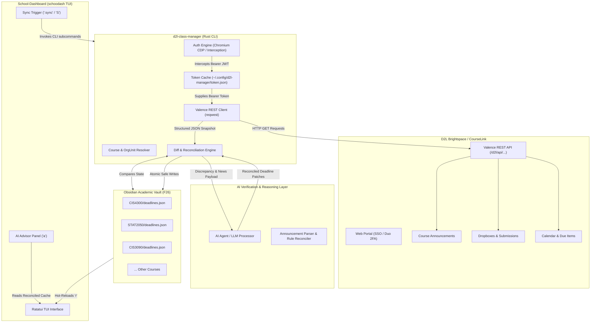
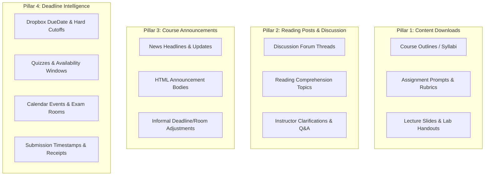
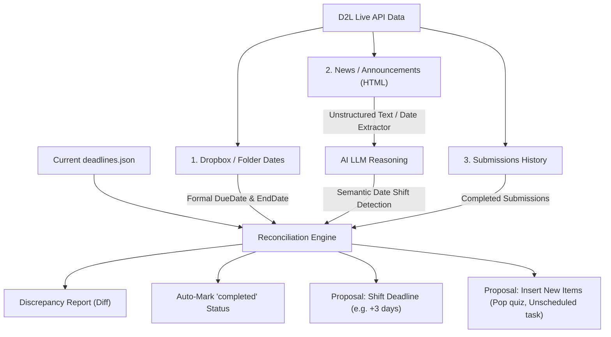
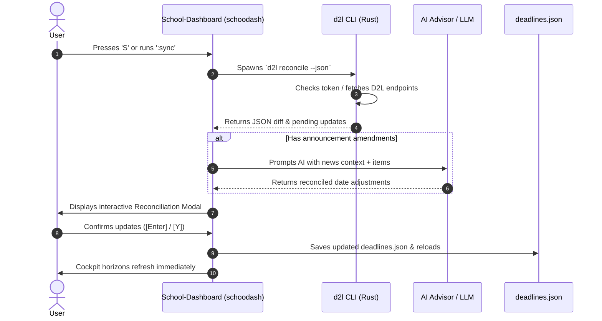

# Architectural Discussion: D2L Brightspace Data Getter & Verification Layer (`d2l-class-manager`)

**Document Status:** Complete Architecture & Design Discussion  
**Target Project:** `d2l-class-manager` (Rust CLI)  
**Companion Projects:** [`School-Dashboard`](file:///home/lmb/Desktop/projects/School-Dashboard) (`schoodash`), Obsidian Academic Vault (`/home/lmb/Documents/LeeOsVault/F26`)  
**Reference Findings:** [`docs/findings.md`](file:///home/lmb/Desktop/projects/d2l-class-manager/docs/findings.md)  
**Proposal Reference:** [`docs/proposal.md`](file:///home/lmb/Desktop/projects/d2l-class-manager/docs/proposal.md)  

---

## 1. Executive Summary & Vision

University students interacting with D2L Brightspace (such as University of Guelph's **CourseLink** at `courselink.uoguelph.ca`) face severe interface fragmentation:
- Critical course intelligence is siloed across separate tabs per course: **Announcements / News**, **Dropbox Folders**, **Quizzes**, **Content TOC**, **Calendar**, and **Grades**.
- Course deadlines are frequently dynamic: instructors post updates in announcements (e.g. extending an assignment deadline, shifting exam rooms, or releasing project guidelines), which renders static course outlines out of date.
- While the user has already implemented a high-performance terminal cockpit in [`School-Dashboard`](file:///home/lmb/Desktop/projects/School-Dashboard) (`schoodash`) that consumes modular `deadlines.json` files per course from an Obsidian vault, there is currently **no automated pipeline to ingest, verify, and reconcile live D2L data** into this vault.

### The Objective
Build **`d2l-class-manager`** as a modular, blazing-fast **Rust CLI** that:
1. **Solves Institutional Authentication:** Overcomes SSO + Duo 2FA by intercepting ephemeral Bearer JWTs via browser session automation.
2. **Harvests Valence REST API Data:** Pulls structured data across enrollments, announcements, dropboxes, calendar events, quizzes, and submission history in read-only mode.
3. **Serves as an AI Verification Layer:** Exposes deterministic, machine-readable JSON snapshots of course state so an AI agent (or the TUI's internal AI Advisor) can reconcile discrepancies, identify deadline shifts from announcements, and verify whether assignments are submitted.
4. **Interfaces Seamlessly with `School-Dashboard`:** Provides clean integration hooks so the user can trigger syncing directly from the TUI or command line.

---

## 2. High-Level System Architecture & Ecosystem Topology

The following diagram illustrates how `d2l-class-manager` bridges the gap between D2L Brightspace, AI reasoning, the Obsidian Vault, and the Ratatui TUI:



---

## 3. Deep Dive: Authentication & Session Management in Pure Rust

### 3.1 The Authentication Barrier
As documented in [`docs/findings.md`](file:///home/lmb/Desktop/projects/d2l-class-manager/docs/findings.md):
- D2L Brightspace institutions (including Guelph's CourseLink) use SAML/SSO with mandatory MFA (e.g. Duo Mobile). Direct username/password REST authentication is blocked by the identity provider.
- Web browser single-page application requests to the Valence API carry short-lived Bearer JWTs (`Authorization: Bearer eyJ...`) valid for **~1 hour** (`exp` claim).
- Long-lived session cookies exist within the browser profile (valid across days/weeks until SSO session expiration).

### 3.2 Evaluation of Browser Automation Strategies in Rust

| Strategy | Implementation Details | Pros | Cons | Recommendation |
| :--- | :--- | :--- | :--- | :--- |
| **A. Native Rust CDP (`chromiumoxide`)** | Direct async Chrome DevTools Protocol client communicating with local `/usr/bin/google-chrome-stable` via WebSocket. | - Single compiled Rust binary<br>- No Python / Node.js runtime required<br>- Full control over persistent user profile (`--user-data-dir`)<br>- Native network event interception (`Network.requestWillBeSent`) | Requires Chromium / Google Chrome on host (user already has `/usr/bin/google-chrome-stable`). | **Recommended Primary Engine** |
| **B. Subprocess Helper (Python Playwright)** | Rust spawns a packaged Python script or uv tool running Playwright. | - Quick to clone from existing `d2l-cli` Python implementation. | - Adds Python runtime, pip dependencies, and separate browser binaries.<br>- Violates pure Rust vision. | Fallback / Prototype only |
| **C. Headless Cookie / cURL Jar Scraping** | Attempts to parse raw session cookies from browser profile SQLite databases. | - Lightweight. | - Fragile; cannot handle SAML redirects, CSRF tokens, or modern encrypted browser cookie stores. | Not recommended |

### 3.3 Proposed Rust Auth Flow (`d2l login` / Automatic Refresh)

1. **Storage Specification**:
   - Session tokens stored in: `~/.config/d2l-manager/token.json`
   - File permissions: strictly `0600` (read/write only by owner).
   - JSON Schema:
     ```json
     {
       "host": "courselink.uoguelph.ca",
       "access_token": "eyJhbGciOi...",
       "expires_at": 1728072000,
       "user_id": 123456,
       "unique_name": "student_login",
       "captured_at": "2026-10-04T14:30:00-04:00"
     }
     ```

2. **Resolution Logic**:
   - Check if `~/.config/d2l-manager/token.json` exists.
   - Parse `expires_at`. If `expires_at > (now + 60s)`, use cached token directly (sub-millisecond startup).
   - If expired or missing, trigger the token refresh mechanism:
     1. First attempt: Launch Google Chrome in **headless mode** with the persistent user profile at `~/.config/d2l-manager/browser_profile`. If SSO cookies remain valid, Chrome navigates to `https://courselink.uoguelph.ca/d2l/home`, the SPA initiates API calls, CDP captures `Authorization: Bearer eyJ...`, and terminates in ~1.5 seconds **without any GUI popup**.
     2. Second attempt (if SSO cookies expired): Launch Google Chrome in **headed mode**, allowing the user to complete Duo 2FA / SSO authentication. Once intercepted, save the new token and close the browser.

3. **Dependency-Free JWT Payload Extraction in Rust**:
   - Split token by `.` into 3 parts.
   - Base64-URL decode segment 1 (payload) with padding normalization.
   - Deserialize with `serde_json` to extract `exp`, `sub`, and `tenantid` without heavy cryptographic verification dependencies.

---

## 4. Valence REST Client Architecture (`reqwest`)

### 4.1 Base Configuration & WAF Spoofing
D2L Cloudflare / WAF layers actively reject automated non-browser clients. The `D2LClient` in Rust will construct an HTTP client (`reqwest::Client`) with customized default headers:

```rust
let mut headers = HeaderMap::new();
headers.insert(AUTHORIZATION, HeaderValue::from_str(&format!("Bearer {}", token))?);
headers.insert(ORIGIN, HeaderValue::from_str(&format!("https://{}", host))?);
headers.insert(REFERER, HeaderValue::from_str(&format!("https://{}/", host))?);
headers.insert(USER_AGENT, HeaderValue::from_static(
    "Mozilla/5.0 (X11; Linux x86_64) AppleWebKit/537.36 (KHTML, like Gecko) Chrome/128.0.0.0 Safari/537.36"
));
headers.insert(ACCEPT, HeaderValue::from_static("application/json, text/plain, */*"));
```

### 4.2 Rate Limiting & Resilience
- **HTTP 429 Backoff**: Catch `StatusCode::TOO_MANY_REQUESTS`.
- Parse `Retry-After` header (seconds), defaulting to 5 seconds.
- Asynchronously sleep using `tokio::time::sleep` up to 3 retries before raising a typed `D2LError::RateLimited`.

### 4.3 Dual-Pagination Engine
D2L utilizes two distinct pagination patterns across its API:

1. **Bookmark Pagination** (e.g. `/enrollments/myenrollments/`):
   ```rust
   #[derive(Deserialize)]
   struct PagedResult<T> {
       #[serde(rename = "PagingInfo")]
       paging_info: PagingInfo,
       #[serde(rename = "Items")]
       items: Vec<T>,
   }

   #[derive(Deserialize)]
   struct PagingInfo {
       #[serde(rename = "Bookmark")]
       bookmark: Option<String>,
       #[serde(rename = "HasMoreItems")]
       has_more_items: bool,
   }
   ```
   Loop while `has_more_items == true`, setting query parameter `?bookmark=<value>`.

2. **Page-Number Pagination** (e.g. discussions / news):
   Query parameters `?pageSize=50&pageNumber=N`. Loop until received slice length `< pageSize`.

### 4.4 Binary & Bulk Data Download Capabilities in Valence API

A common architectural question is: **Is it possible to download actual files and bulk data through the Valence REST API?**

**Yes, absolutely.** The D2L Valence API provides comprehensive native support for downloading both **raw binary files/documents** and **complete structured data trees** directly over HTTP GET requests using the student Bearer JWT.

#### 1. Binary File Download Endpoints (Streamed Content)
D2L streams actual binary bytes with standard HTTP headers for several key resource types:

| Download Target | Endpoint | Response Type & Notes |
| :--- | :--- | :--- |
| **Content Topic Files** (Lecture Slides, PDFs, Code Handouts) | `GET /d2l/api/le/1.80/{org_id}/content/topics/{topic_id}/file` | Returns raw file bytes (`application/pdf`, `application/zip`, `application/octet-stream`). Filename provided in `Content-Disposition`. |
| **Assignment Prompt Attachments** (Rubrics, Starter Kits) | `GET /d2l/api/le/1.80/{org_id}/dropbox/folders/{folder_id}/attachments/{file_id}` | Streams instructor-attached prompt documents and starter archives. |
| **Student Submissions** (User's Submitted Files & Code) | `GET /d2l/api/le/1.80/{org_id}/dropbox/folders/{folder_id}/submissions/{submission_id}/files/{file_id}` | Streams the exact file previously uploaded by the student. Useful for receipt verification and local backups. |
| **Announcement Attachments** | `GET /d2l/api/le/1.80/{org_id}/news/{news_id}/attachments/{file_id}` | Files attached to instructor news broadcasts. |
| **Grading Feedback Attachments** | `GET /d2l/api/le/1.80/{org_id}/dropbox/folders/{folder_id}/feedback/{feedback_id}/attachments/{file_id}` | Graded rubrics, annotated PDFs, or feedback sheets returned by the instructor/TA. |

#### 2. Filename & Metadata Extraction
When streaming a file, D2L does not embed the filename in the URL path. Instead, it provides the original filename in the standard HTTP `Content-Disposition` header:
```http
HTTP/1.1 200 OK
Content-Type: application/pdf
Content-Length: 4892110
Content-Disposition: attachment; filename="Week05_LowFi_Prototyping.pdf"; filename*=UTF-8''Week05_LowFi_Prototyping.pdf
```
In Rust, the filename can be parsed reliably via regex or header extraction:
```rust
let filename = response
    .headers()
    .get(header::CONTENT_DISPOSITION)
    .and_then(|cd| cd.to_str().ok())
    .and_then(|cd_str| {
        // Extracts filename from: filename="foo.pdf" or filename*=UTF-8''foo.pdf
        let re = regex::Regex::new(r#"filename[*]?=(?:UTF-8'')?"?([^";]+)"?"#).ok()?;
        re.captures(cd_str).and_then(|cap| cap.get(1).map(|m| m.as_str().to_string()))
    })
    .unwrap_or_else(|| format!("download_{}.bin", topic_id));
```

#### 3. Rust Async Streaming Implementation (`reqwest` + `tokio::fs`)
To prevent loading large files (e.g. 50 MB slide decks or lecture recordings) entirely into memory, `d2l-class-manager` can stream chunks directly to disk:
```rust
use futures_util::StreamExt;
use tokio::fs::File;
use tokio::io::AsyncWriteExt;

pub async fn download_topic_file(
    client: &reqwest::Client,
    host: &str,
    org_id: i64,
    topic_id: i64,
    destination: &std::path::Path,
) -> anyhow::Result<()> {
    let url = format!("https://{}/d2l/api/le/1.80/{}/content/topics/{}/file", host, org_id, topic_id);
    let mut res = client.get(&url).send().await?.error_for_status()?;
    
    let mut file = File::create(destination).await?;
    let mut stream = res.bytes_stream();

    while let Some(chunk) = stream.next().await {
        let chunk = chunk?;
        file.write_all(&chunk).await?;
    }
    file.flush().await?;
    Ok(())
}
```

#### 4. Structured Data Trees (Bulk Course Hierarchy Downloads)
Beyond binary files, Valence supports downloading complete nested hierarchical structures in a single query:
- **Complete Course Table of Contents (TOC):**
  `GET /d2l/api/le/1.80/{org_id}/content/toc`
  Returns the entire semester's course outline, all modules, sub-modules, topic IDs, file types, and activity descriptions in a single JSON payload.
- **Bulk Multi-Course Endpoints:**
  Endpoints like `/d2l/api/le/1.80/calendar/events/myEvents/?orgUnitIdsCSV=1073361,1073362` and `/d2l/api/le/1.80/grades/final/values/myGradeValues/?orgUnitIdsCSV=...` allow downloading semester-wide data across all 5 courses in a single network round-trip.

#### 5. Permissions & Limitations
- **What a Student Can Download:** Any content topic, handout, prompt, rubric, feedback file, or personal submission that is published and accessible within their active enrollments.
- **What Requires Admin/Instructor Privileges:** Institutional Brightspace Data Sets (BDS bulk database CSV dumps) and Course Package Exports (IMS Common Cartridge/BEEP packages) require administrative roles and are not available on student tokens. However, the student-accessible REST endpoints cover 100% of the materials and records required for our local vault and AI cockpit.

---

## 5. Scope of Data Interest: The 4 Core Pillars

Based on user requirements, the scope of data harvested by `d2l-class-manager` is structured around **four primary functional pillars**:



### Pillar 1: Content & Document Downloads (Outlines, Assignments, Handouts)
- **Target Assets**:
  - Course Outlines / Syllabi (PDF / SimpleSyllabus docs).
  - Assignment specification PDFs, starter code archives (`.zip`, `.tar.gz`), and rubric sheets attached to dropbox folders.
  - Module content: lecture slide decks (`.pdf`, `.pptx`), lab worksheets, and required reading PDFs.
- **Valence REST Endpoints**:
  - `GET /d2l/api/le/1.80/{org_id}/content/toc` (Walks full course tree).
  - `GET /d2l/api/le/1.80/{org_id}/content/topics/{topic_id}/file` (Streams raw content file).
  - `GET /d2l/api/le/1.80/{org_id}/dropbox/folders/{folder_id}/attachments/{file_id}` (Streams assignment prompts).
- **Storage & Pipeline**:
  - Files are streamed directly into the local vault directory:
    `$SCHOOL_DASHBOARD_VAULT/<COURSE>/Materials/` or `Assignments/`.
  - Content-Disposition headers are decoded to preserve authentic filenames.

### Pillar 2: Reading Posts & Discussion Content
- **Target Assets**:
  - Assigned reading response threads (e.g. weekly reading critiques, peer discussion prompts).
  - Instructor-pinned clarification posts on assignment forums.
  - Rich-text HTML content pages embedded directly inside Content modules (e.g. introductory notes or reading guidelines).
- **Valence REST Endpoints**:
  - `GET /d2l/api/le/1.80/{org_id}/discussions/forums/` (Enumerate course forums).
  - `GET /d2l/api/le/1.80/{org_id}/discussions/forums/{forum_id}/topics/` (Enumerate topics/readings).
  - `GET /d2l/api/le/1.80/{org_id}/discussions/forums/{forum_id}/topics/{topic_id}/posts/?pageNumber=N&pageSize=50` (Retrieve thread posts, replies, author, HTML body).
- **Text Normalization**:
  - Ingested HTML posts are stripped of styling and converted into clean **Markdown** via `html2text`.
  - Accessible via CLI (`d2l posts --course <ID>`) or exported as local markdown files in the vault so the student can read them in Neovim or pass them to an LLM for summarization.

### Pillar 3: Course Announcements (News & Bulletins)
- **Target Assets**:
  - Official instructor broadcasts, class cancellations, weather closures, syllabus amendments, and exam room updates.
- **Valence REST Endpoints**:
  - `GET /d2l/api/le/1.80/{org_id}/news/?since={iso_date}` (Returns published news items).
- **Operational Value**:
  - Primary fodder for the AI Verification Layer. Instructors regularly shift deadlines informally in announcements without updating the formal Dropbox tool.

### Pillar 4: All Data Related to Deadlines & Milestones
- **Target Assets**:
  - **Formal Assignment Dropboxes**: `DueDate`, `EndDate` (hard lock), `StartDate` (release date), and point weights.
  - **Quizzes & Online Assessments**: Start/End dates, time limits, and attempt counts.
  - **Aggregated Due & Overdue Feeds**: Valence cross-course endpoints `/content/myItems/due/` and `/overdueItems/myItems`.
  - **Calendar Schedule**: Academic drop deadlines, review sessions, in-person exam dates/rooms.
  - **Submission Verification**: Querying `/submissions/mysubmissions/` to capture timestamps and file existence.
- **Valence REST Endpoints**:
  - `GET /d2l/api/le/1.80/{org_id}/dropbox/folders/`
  - `GET /d2l/api/le/1.80/{org_id}/quizzes/`
  - `GET /d2l/api/le/1.80/calendar/events/myEvents/?orgUnitIdsCSV={csv}`
  - `GET /d2l/api/le/1.80/content/myItems/due/`
  - `GET /d2l/api/le/1.80/{org_id}/dropbox/folders/{folder_id}/submissions/mysubmissions/`
- **Operational Value**:
  - Feeds directly into `School-Dashboard`'s [`deadlines.json`](file:///home/lmb/Documents/LeeOsVault/F26/CIS4300/deadlines.json). Drives the Immediate Focus (0-7 days) and Radar (7-14 days) views. Auto-marks tasks `completed` upon verified submission.

---

## 6. Course Mapping & OrgUnit ID Resolution

### 6.1 The Alignment Problem
In the user's Obsidian Vault (`/home/lmb/Documents/LeeOsVault/F26`):
- Folders are named by Course Code: `CIS4300/`, `CTS3020/`, `STAT2050/`, `CIS3090/`, `CIS4020/`.
- In `CIS4300/deadlines.json`, we find:
  ```json
  "course_code": "CIS*4300",
  "links": {
    "courselink": "https://courselink.uoguelph.ca/d2l/home/1073361"
  }
  ```
  The numeric string `1073361` is the **OrgUnit ID** required by all D2L Valence endpoints (`/d2l/api/le/1.80/{org_id}/...`).

### 6.2 Two-Way Resolution Strategy
`d2l-class-manager` will support three tiers of course resolution:

1. **Vault Introspection (Fastest & 100% Reliable)**:
   - When run with `--vault-path <path>` (or default `SCHOOL_DASHBOARD_VAULT`), inspect existing `deadlines.json` files.
   - Extract `links.courselink` regex `r"/d2l/home/(\d+)"` &rarr; maps `CIS*4300` directly to `1073361`.

2. **D2L API Discovery & Fuzzy Match**:
   - Query `/d2l/api/lp/1.47/enrollments/myenrollments/?isActive=true&canAccess=true`.
   - Match course codes using a 4-tier priority ladder:
     1. Exact OrgUnit ID match (e.g. `"1073361"`).
     2. Exact course code match (e.g. `"CIS*4300"` or `"CIS*4300*01"`).
     3. Case-insensitive substring match (e.g. `"4300"` or `"HCI"`).
     4. Token overlap scoring.

3. **Persistent Course Mapping Registry**:
   - Stored at `~/.config/d2l-manager/courses.json`.
   - Caches `org_unit_id <-> course_code <-> course_name` mappings to eliminate duplicate enrollment network queries.

---

## 7. The Verification & Reconciliation Layer (AI + CLI)

The user's core vision states:
> *"I do however want a verification layer where AI can use a CLI that facilitates all of the data getting and so we need only to call from within that TUI. Then AI can reconcile deadlines. For example a teacher might have posted anouncements where we'd need to udpate our deadlines jsons."*

### 7.1 The Three Reconciliation Dimensions



#### Dimension 1: Structured Dropbox / Calendar Verification
- Compare `deadlines.json` item `due_date` against D2L Dropbox `DueDate`:
  - If D2L has a due date differing from `deadlines.json`, flag a **`DATE_MISMATCH`**.
  - If D2L has an assignment dropbox not listed in `deadlines.json`, flag **`MISSING_ITEM`**.

#### Dimension 2: Unstructured Announcement Intelligence (The AI Core)
- Course instructors frequently do **not** update the Dropbox settings when extending deadlines; instead, they post an announcement:
  > *"Hey everyone, because of the server outage, Milestone 1 is now due Monday, Oct 12 at 11:59 PM instead of Friday."*
- Flow:
  1. CLI pulls announcements via `GET /d2l/api/le/1.80/{org_id}/news/?since={timestamp}`.
  2. Strips HTML markup into clean markdown.
  3. Structured prompt passes:
     - The announcement text and posting date.
     - The active course items from `deadlines.json`.
  4. The AI outputs a structured JSON patch:
     ```json
     {
       "course_code": "CIS*4300",
       "action": "UPDATE_DEADLINE",
       "item_id": "cis4300-m1",
       "original_due_date": "2026-10-09T23:59:00-04:00",
       "new_due_date": "2026-10-12T23:59:00-04:00",
       "source_announcement_id": 98432,
       "reasoning": "Announcement posted on Oct 5 explicitly stated Milestone 1 is extended to Monday Oct 12 at 11:59 PM due to server outage."
     }
     ```

#### Dimension 3: Submission Verification (Automated Progress Tracking)
- Query `GET /d2l/api/le/1.80/{org_id}/dropbox/folders/{folder_id}/submissions/mysubmissions/`.
- If submissions exist and item status in `deadlines.json` is `todo` or `in_progress`, auto-propose or auto-apply:
  `status: "completed"`.

### 7.2 Data Safety & Idempotent Vault Updating
When modifying `deadlines.json` in the Obsidian Vault:
1. **Zero Data Loss Guarantee**: Strict deserialization and re-serialization preserving all auxiliary fields (`instructor`, `color`, `links`, `policies`, `notes`, `weight`, `lead_time_days`).
2. **Automatic Backup**: Write `.bak` file before altering disk contents (e.g. `deadlines.json.bak`).
3. **Dry-Run Default**: The CLI will default to `--dry-run` or outputting a JSON diff unless explicitly passed `--apply`.

---

## 8. CLI Subcommand Hierarchy & Specification

The CLI binary will be named **`d2l`** (or `d2l-manager`).

```
d2l [OPTIONS] <COMMAND>

OPTIONS:
  -v, --verbose          Increase logging verbosity
      --json             Force machine-readable JSON output on stdout
      --config <PATH>    Custom path to config file

COMMANDS:
  login                  Interactive or background browser login to capture token
  status                 Check token validity, expiration, and user identity
  courses                List enrolled courses and mapped OrgUnit IDs
  announcements          Fetch news announcements (with optional --since or --course)
  assignments            List dropbox assignments, due dates, and submission state
  download               Download course content, outlines, and assignment handouts
  posts                  Fetch and read discussion forum posts, threads, and reading topics
  calendar               Fetch upcoming calendar and schedule events
  quizzes                List online quizzes, availability windows, and attempts
  grades                 List grade items and current marks
  dump                   Export comprehensive unified JSON snapshot of courses
  reconcile              Compare D2L live state with vault deadlines.json and generate diff
```

### Key Subcommand Details:

#### 1. `d2l login`
- Flags: `--headless` (force background), `--force` (ignore cached token).
- Action: Launches browser interception; writes `~/.config/d2l-manager/token.json`.

#### 2. `d2l download`
- Options: `-c, --course <CODE|ID>`, `--type <all|assignments|content|syllabus>`, `--dest <PATH>`.
- Action: Streams files from Content TOC or Dropbox attachments directly into the vault (e.g. `LeeOsVault/F26/<COURSE>/Materials/`).

#### 3. `d2l posts`
- Options: `-c, --course <CODE|ID>`, `--forum <ID>`, `--topic <ID>`, `--limit <N>`.
- Action: Enumerates discussion boards and reading response threads, strips HTML, and prints clean Markdown or saves to vault.

#### 4. `d2l announcements`
- Options: `-c, --course <CODE|ID>`, `--since <ISO_DATE>`, `--limit <N>`.
- Formats: Pretty terminal table (default) or JSON (`--json`).

#### 5. `d2l dump`
- Options: `-c, --course <CODE|ID>`, `--vault <PATH>`.
- Purpose: The primary pipeline command for AI ingestion. Aggregates course metadata, announcements, dropboxes, quizzes, and calendar events into a single normalized JSON document.

#### 6. `d2l reconcile`
- Options: `-c, --course <CODE|ID>`, `--vault <PATH>`, `--apply`, `--dry-run`.
- Output: Structured discrepancy report showing differences between D2L and `deadlines.json`.

---

## 9. Integration Architecture with `School-Dashboard` (`schoodash`)

How should the TUI Cockpit and the CLI interact?

### 9.1 Invocation Patterns



### 9.2 TUI Modal Interface for Reconciliation
Inside `School-Dashboard`:
- A keybind (e.g. `S` or command `:sync`) displays a status popup: `"Querying CourseLink Valence API..."`.
- If discrepancies or announcement changes are detected, a **Reconciliation Review Modal** opens showing:
  - 🔄 **Deadline Extended:** `CIS*4300 Milestone 1`: Oct 9 &rarr; **Oct 12** *(Source: Announcement "M1 Extension" by Prof. Kotseruba)*
  - ✅ **Completed Item:** `STAT*2050 Assignment 2`: Submitted on D2L &rarr; Mark as **Completed**
  - ⚠️ **New Event:** `CIS*3090 Pop Quiz 2`: Due Oct 14 &rarr; Add to vault
- The user can accept all (`<Enter>`), cherry-pick (`<Space>`), or cancel (`<Esc>`).

---

## 10. Crate Selection & Dependencies for `d2l-class-manager`

To keep the binary fast, robust, and maintainable, the following Rust crates are recommended:

| Crate | Purpose |
| :--- | :--- |
| `tokio` (features `["full"]`) | Asynchronous runtime for HTTP and browser WebSocket handling. |
| `clap` (features `["derive", "env"]`) | Modern, type-safe CLI argument parsing. |
| `reqwest` (features `["json", "rustls-tls"]`) | Fast HTTP client with TLS and JSON serialization. |
| `serde` & `serde_json` | Type-safe JSON serialization/deserialization. |
| `chromiumoxide` | Pure Rust Chrome DevTools Protocol (CDP) client for headless/headed browser automation and header interception. |
| `chrono` (features `["serde"]`) | Timezone-aware date/time handling (matching `School-Dashboard`'s timestamp standards). |
| `comfy-table` or `ratatui` | Terminal table rendering for human-facing CLI output. |
| `directories` | Standard XDG base directory resolution (`~/.config/d2l-manager/`). |
| `anyhow` & `thiserror` | Structured, actionable error handling. |
| `html2text` or `scraper` | Stripping HTML from announcement and syllabus bodies into clean markdown/plain text for LLM consumption. |

---

## 11. Key Design Questions & Tradeoffs for User Alignment

Before finalizing `implementation.md`, the following architectural questions should be discussed and confirmed:

1. **Browser Binary vs. Pure Native Execution**:
   - `chromiumoxide` will launch the user's installed Google Chrome (`/usr/bin/google-chrome-stable`). This avoids downloading extra multi-hundred-megabyte browser binaries like Playwright does. Is using the system Google Chrome acceptable?
2. **AI Execution Locus**:
   - Should `d2l-class-manager` itself include an embedded command to call an LLM (e.g. `d2l ai-reconcile` calling OpenAI / Anthropic / Gemini via API key or local Ollama), OR should `d2l-class-manager` focus strictly on producing structured JSON data snapshots, leaving the LLM prompting to `School-Dashboard`'s AI Advisor or an external agent?
3. **Course Code Mapping Default**:
   - Should `d2l-class-manager` auto-read the user's vault path (`/home/lmb/Documents/LeeOsVault/F26`) by default when no arguments are provided, exactly like `School-Dashboard` does?
4. **Automated Submission Status Syncing**:
   - When the tool detects that an assignment has been submitted in D2L Dropbox, should it automatically flip the status in `deadlines.json` to `completed`, or should it always ask for confirmation?

---

*This discussion document is prepared for immediate review and will serve as the architectural foundation for [`docs/implementation.md`](file:///home/lmb/Desktop/projects/d2l-class-manager/docs/implementation.md).*
