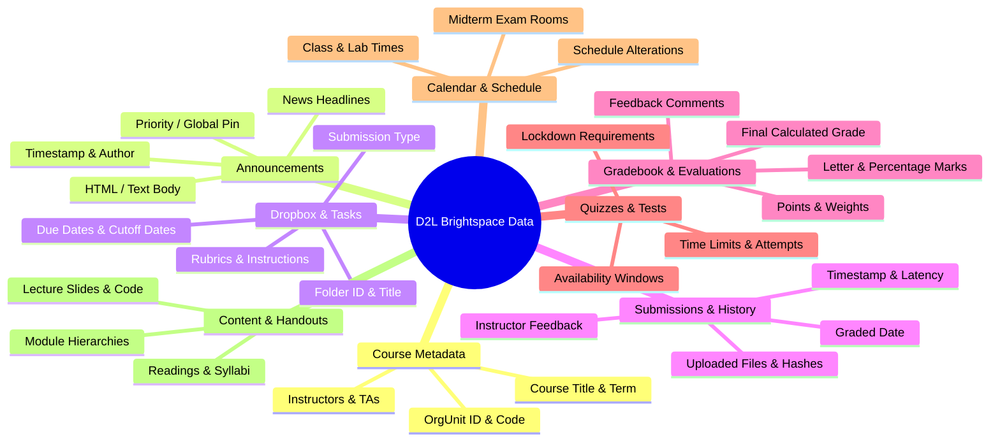
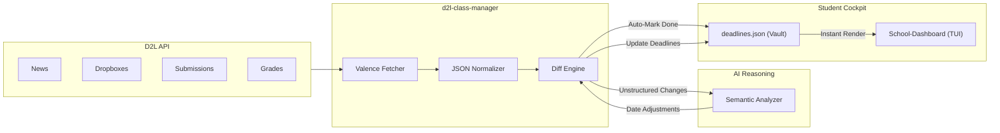

# D2L Data Interest & Academic Intelligence Use Cases (`use-cases.md`)

**Document Status:** Complete Specification  
**Target Project:** `d2l-class-manager` (Rust CLI)  
**Companion Projects:** [`School-Dashboard`](file:///home/lmb/Desktop/projects/School-Dashboard) (`schoodash`), Obsidian Academic Vault (`/home/lmb/Documents/LeeOsVault/F26`)  
**Companion Documents:** [`docs/discussion.md`](file:///home/lmb/Desktop/projects/d2l-class-manager/docs/discussion.md), [`docs/findings.md`](file:///home/lmb/Desktop/projects/d2l-class-manager/docs/findings.md), [`docs/proposal.md`](file:///home/lmb/Desktop/projects/d2l-class-manager/docs/proposal.md)  

---

## 1. Executive Context & Purpose

The purpose of `d2l-class-manager` is not simply to mirror D2L Brightspace / CourseLink in a terminal, but to **liberate high-value academic data from siloed web portals** and pipe it into a local, keyboard-driven workflow.

By pairing a **Rust data extraction CLI** with the existing **`School-Dashboard`** TUI and an **AI Verification Layer**, we transform passive, scattered course information into active, predictive academic intelligence.

This document identifies:

1. **The specific data domains we are interested in** from D2L Brightspace.
2. **What we can achieve from knowing this data** (concrete, high-impact use cases).
3. **The data-to-capability mapping matrix**.

---

## 2. Comprehensive Inventory of Interested D2L Data

D2L Brightspace (via the Valence REST API and external syllabus integrations) exposes a wealth of structured and semi-structured entities. The table below outlines the core datasets relevant to `d2l-class-manager`:



### 2.1 Detailed Data Breakdown

| Data Domain                    | Valence API Endpoint / Source                                                   | Specific Fields of Interest                                                                                            | Update Frequency           |
|:------------------------------ |:------------------------------------------------------------------------------- |:---------------------------------------------------------------------------------------------------------------------- |:-------------------------- |
| **1. Announcements (News)**    | `GET /d2l/api/le/1.80/{org_id}/news/`                                           | `Id`, `Title`, `Body.Html`, `Body.Text`, `StartDate`, `EndDate`, `IsPublished`                                         | Daily / Ad-hoc             |
| **2. Dropbox Assignments**     | `GET /d2l/api/le/1.80/{org_id}/dropbox/folders/`                                | `Id`, `Name`, `CustomInstructions`, `DueDate`, `EndDate` (hard cutoff), `StartDate`, `Assessment.OutOf`, `Attachments` | Weekly / Bi-weekly         |
| **3. Submissions & Receipts**  | `GET /d2l/api/le/1.80/{org_id}/dropbox/folders/{id}/submissions/mysubmissions/` | `Id`, `FolderId`, `SubmissionDate`, `Files[].FileName`, `Files[].FileSize`, `Feedback`                                 | On submission              |
| **4. Grade Items & Standing**  | `GET /d2l/api/le/1.80/{org_id}/grades/values/myGradeValues/`                    | `GradeObjectName`, `PointsNumerator`, `PointsDenominator`, `WeightedNumerator`, `WeightedDenominator`, `Comments`      | After marking              |
| **5. Final Course Grades**     | `GET /d2l/api/le/1.80/grades/final/values/myGradeValues/?orgUnitIdsCSV={csv}`   | `OrgUnitId`, `PointsNumerator`, `DisplayedGrade`                                                                       | End of term / Rolling      |
| **6. Quizzes & Exams**         | `GET /d2l/api/le/1.80/{org_id}/quizzes/`                                        | `QuizId`, `Name`, `StartDate`, `EndDate`, `DueDate`, `TimeLimit`, `AttemptsAllowed`, `AttemptsTaken`                   | Weekly                     |
| **7. Calendar Events**         | `GET /d2l/api/le/1.80/calendar/events/myEvents/`                                | `EventId`, `Title`, `Description`, `StartDateTime`, `EndDateTime`, `Location` (room/URL)                               | Weekly                     |
| **8. Due / Overdue Items**     | `GET /d2l/api/le/1.80/content/myItems/due/` & `overdueItems/myItems`            | Direct list of cross-course upcoming and overdue items                                                                 | Real-time                  |
| **9. Content TOC (Materials)** | `GET /d2l/api/le/1.80/{org_id}/content/toc`                                     | `Modules[].Title`, `Topics[].Title`, `Topics[].Url`, `Topics[].Identifier`, `TypeIdentifier`                           | Weekly                     |
| **10. Syllabi & Policies**     | SimpleSyllabus API / Course Outline PDFs                                        | Grading schemes, late penalties, grace day pool rules, exam passing thresholds                                         | Static / Once per semester |

---

## 3. What We Can Achieve: Concrete Use Cases & Capabilities

Knowing this data unlocks high-leverage capabilities spanning real-time reconciliation, proactive risk management, automated study planning, and frictionless task tracking.

---

### Use Case 1: Dynamic Deadline Reconciliation & Announcement Intelligence

* **The Problem:** Instructors regularly amend deadlines informally via announcements (e.g. *"Due to Thanksgiving, Milestone 1 is pushed to Wednesday Oct 14 at 11:59 PM"*), but rarely remember to update the formal D2L Dropbox or the syllabus PDF. Students relying on static dates miss out or scramble unnecessarily.
* **What We Achieve:**
  - The CLI fetches recent announcements (`d2l announcements --since <date>`).
  - An LLM analyzes the announcement text against the current [`deadlines.json`](file:///home/lmb/Documents/LeeOsVault/F26/CIS4300/deadlines.json) registry.
  - The AI identifies semantic date modifications, room relocations, or scope changes.
  - Generates a proposed diff for the user's Obsidian vault.
* **Cockpit Impact:** Deadlines in `schoodash` always reflect reality—even when the instructor only communicated the change in a paragraph of text.

---

### Use Case 2: Frictionless Task Lifecycle & Submission Receipt Verification

* **The Problem:** When an assignment is finished and submitted on D2L, the student must manually remember to switch the task to `completed` in `School-Dashboard`. Furthermore, "submission anxiety" often causes students to repeatedly re-log into CourseLink just to verify that their PDF or zip file actually went through.
* **What We Achieve:**
  - The CLI queries `mysubmissions` for each active dropbox folder.
  - If a valid submission exists, `d2l-class-manager`:
    1. **Auto-marks status:** Automatically updates `status: "completed"` in `deadlines.json`.
    2. **Verifies submission integrity:** Confirms file name, byte size ($>0$ bytes), and submission timestamp before the official deadline.
    3. **Logs the receipt:** Records the D2L confirmation details locally.
* **Cockpit Impact:** Zero manual admin overhead. You hit submit on D2L, and your terminal cockpit automatically turns the task green.

---

### Use Case 3: Policy Enforcement & Grace Day Budget Optimization

* **The Problem:** In courses like `CIS*4300` (Human-Computer Interaction), instructors offer **3 team grace days total** across milestones (M1–M3). Miscalculating or prematurely blowing grace days early in the term can be disastrous for late-semester deliverables.

* **What We Achieve:**
  
  - By cross-referencing exact submission timestamps from `mysubmissions` with official due dates:
    - Calculates exact hours late.
    - Computes remaining grace days balance ($3 - \text{consumed}$).
    - Warns the AI Advisor when grace day reserves are running critically low.

* **Cockpit Impact:** The AI Strategic Advisor can recommend:  
  
  > *"You have 2 grace days remaining for CIS\*4300. Since M2 is worth 25% and you have a STAT\*2050 midterm on Monday, it is mathematically optimal to deploy 1 grace day on M2."*

---

### Use Case 4: Real-Time Gradebook Ledger & "What-If" Final Grade Forecasting

* **The Problem:** D2L's gradebook interface is notoriously clunky, burying weights, feedback, and statistics in deeply nested sub-pages. Students rarely know their exact weighted standing in real time.
* **What We Achieve:**
  - Ingests all graded items, weights, and feedback via `/grades/values/myGradeValues/`.
  - Computes:
    - **Current Standing:** Total marks earned divided by total weight assessed so far.
    - **Minimum Required Exam Score:** The exact score needed on the Final Exam to maintain an A (85%), A- (80%), or B (70%).
    - **Policy Gatekeeper Checks:** Verifies that passing rules are satisfied (e.g. `passing_rule: "Must obtain >= 50% on Final Exam to pass course"` in `CIS*4300`).
* **Cockpit Impact:** Replaces guessing with hard numbers. The user can view a live grade ledger right inside the cockpit inspector.

---

### Use Case 5: Academic Bottleneck Deconfliction & Reverse-Scheduling

* **The Problem:** Multiple heavy assignments across different courses frequently collide in the same 48-hour window (e.g. CIS\*3090 parallel lab + CIS\*4020 data science project + STAT\*2050 midterm).
* **What We Achieve:**
  - Combines due dates, weight percentages, and `lead_time_days` from all 5 courses into a single timeline.
  - Identifies **Critical Overload Windows** (e.g. $>35\%$ total academic weight due within 72 hours).
  - The AI Advisor reverse-schedules preparation checkpoints:
    - *Milestone 1: Finish CIS\*3090 implementation 4 days early.*
    - *Milestone 2: Dedicate weekend strictly to STAT\*2050 practice exams.*
* **Cockpit Impact:** Eliminates last-minute all-nighters by flagging conflicts 14–21 days in advance on the Radar panel.

---

### Use Case 6: Course Materials Mirroring & Local Knowledge Base (RAG)

* **The Problem:** Lecture slides, lab starter repos, and datasets are trapped behind Brightspace's web viewer, requiring repetitive manual downloading.

* **What We Achieve:**
  
  - Walks the Content TOC (`/content/toc`) and downloads newly posted lecture notes, PDFs, and code attachments into structured local directories:
    
    ```
    ~/Documents/LeeOsVault/F26/
    ├── CIS4300/Materials/Week05_LowFi_Prototyping.pdf
    ├── CIS3090/Materials/Lab3_OpenMP_Starter.tar.gz
    └── STAT2050/Materials/Lecture12_ANOVA.pdf
    ```
  
  - Enables local command-line search (`ripgrep`, `rga`, or local LLM embeddings) across all lecture slides and assignments.

* **Cockpit Impact:** Instantaneous access to lecture references when coding or studying, completely offline.

---

### Use Case 7: Morning Intelligence Briefing & Change-Delta Feed

* **The Problem:** Checking 5 separate course homepages every morning to see if an instructor posted an announcement, changed an office hour location, or opened a quiz is tedious and prone to oversight.

* **What We Achieve:**
  
  - A single CLI command `d2l briefing` (or a prompt in `schoodash`) outputs a concise executive summary of the last 24–48 hours:
    
    ```
    ========================================================================
    ⚡ D2L ACADEMIC BRIEFING (Oct 4, 2026)
    ========================================================================
    📢 NEW ANNOUNCEMENTS (2):
       • [CIS*4300] "M1 Submission Dropbox Open" — Prof. Kotseruba (Oct 3)
       • [STAT*2050] "Midterm 1 Review Session Room: MCKN 224" — Prof. Balka (Oct 4)
    
    🎯 UPCOMING DEADLINES (Next 7 Days):
       • [CIS*4300] Milestone 1: Needfinding (10.0%) — Due Friday, Oct 9 @ 23:59
         Status: In Progress | Days Remaining: 5.3
    
    ✅ RECENT SUBMISSIONS:
       • [CIS*3090] Assignment 1 — Submitted Oct 2 (Receipt Verified: 242 KB)
    
    📊 NEW GRADES RELEASED:
       • [CTS*3020] Story Analysis 1: 18.5/20 (92.5%) — "Excellent analysis!"
    ========================================================================
    ```

* **Cockpit Impact:** Complete academic situational awareness in under 3 seconds.

---

### Use Case 8: Reading Posts & Discussion Forum Ingestion

* **The Problem:** Reading assignments, peer discussions, and instructor clarifications are trapped in D2L's cumbersome discussion boards. Reading threads requires opening multiple nested tabs and dealing with poor typography and web clutter.
* **What We Achieve:**
  - The CLI queries discussion forums and topics via `/discussions/forums/{forum_id}/topics/{topic_id}/posts/`.
  - Strips web styling and converts HTML discussion bodies into clean, distraction-free **Markdown**.
  - Allows exporting reading threads directly into the local vault:
    
    ```
    ~/Documents/LeeOsVault/F26/<COURSE>/Readings/Week04_Discussion_Prompt.md
    ```
  - Enables reading via terminal pager, Neovim (`$EDITOR`), or passing discussion threads to an AI agent for instant summarization and key-takeaway extraction before class.
* **Cockpit Impact:** Zero-friction reading of course prompts and peer discussions in your preferred local environment.

---

## 4. Data-to-Capability Mapping Matrix

The matrix below shows how each raw D2L data entity directly powers the end-user capabilities:

| Raw D2L Data Entity             | Primary Valence Endpoint                          | Primary Use Cases Powered                                         | Value to Student                                                               |
|:------------------------------- |:------------------------------------------------- |:----------------------------------------------------------------- |:------------------------------------------------------------------------------ |
| **News Announcements**          | `/news/?since={timestamp}`                        | Use Case 1 (Date Reconciliation)<br>Use Case 7 (Morning Briefing) | Never miss an informal date change, snow day cancellation, or exam room shift. |
| **Dropbox Folders**             | `/dropbox/folders/`                               | Use Case 1 (Formal Dates)<br>Use Case 5 (Bottleneck Analysis)     | Authoritative due dates and cut-offs synchronized directly to Obsidian vault.  |
| **Dropbox Submissions**         | `/submissions/mysubmissions/`                     | Use Case 2 (Auto-Complete)<br>Use Case 3 (Grace Days)             | Eliminates submission anxiety and automates status updates in `schoodash`.     |
| **Discussion Posts & Readings** | `/discussions/forums/{f_id}/topics/{t_id}/posts/` | Use Case 8 (Reading Ingestion)                                    | Read assigned prompts and threads in clean Markdown locally or feed to AI.     |
| **Grade Values**                | `/grades/values/myGradeValues/`                   | Use Case 4 (What-If Grade Modeling)                               | Instant clarity on current weighted standing and required final exam grades.   |
| **Quizzes**                     | `/quizzes/`                                       | Use Case 1 (Unscheduled Quizzes)<br>Use Case 7 (Briefing)         | Catch short-window quizzes before they close.                                  |
| **Calendar Events**             | `/calendar/events/myEvents/`                      | Use Case 5 (Schedule Alignment)<br>Use Case 7 (Briefing)          | Ingest university holidays, drop dates, and special lab/exam sessions.         |
| **Content TOC & Files**         | `/content/toc` & `/topics/{id}/file`              | Use Case 6 (Course Materials Mirroring)                           | Automated local archive of all lecture slides, outlines, and course handouts.  |
| **Course Syllabi**              | SimpleSyllabus API / Vault                        | Use Case 3 (Policies)<br>Use Case 4 (Passing Gates)               | Codified policy tracking (e.g. exam passing thresholds, late penalties).       |

---

## 5. Architectural Flow: From Raw Data to Vault & Cockpit



---

## 6. Next Steps & Implementation Prioritization

Based on these use cases, the implementation should be phased strategically to deliver immediate value first:

1. **Phase 1 (The Core Data Engine):**
   - Authentication capture + Valence REST client.
   - Implement `d2l assignments`, `d2l submissions`, and `d2l announcements`.
   - Deliver **Use Case 1 (Formal Date Sync)** and **Use Case 2 (Auto-Mark Completed)**.
2. **Phase 2 (The AI Verification Layer):**
   - Announcement markdown stripping + LLM discrepancy detection prompt.
   - Structured JSON patch generator for vault `deadlines.json`.
   - Deliver **Use Case 1 (Announcement Intelligence)** and **Use Case 7 (Morning Briefing)**.
3. **Phase 3 (Grades & Policies):**
   - Valence gradebook ingestion + SimpleSyllabus policy mapping.
   - Deliver **Use Case 3 (Grace Days)** and **Use Case 4 (What-If Grade Forecasting)**.
4. **Phase 4 (Content & Materials Pipeline):**
   - Content TOC crawler + local PDF/slides synchronization.
   - Deliver **Use Case 6 (Materials Mirroring)**.

---

*This document is ready to be referenced directly by [`docs/implementation.md`](file:///home/lmb/Desktop/projects/d2l-class-manager/docs/implementation.md) for concrete milestone planning.*
